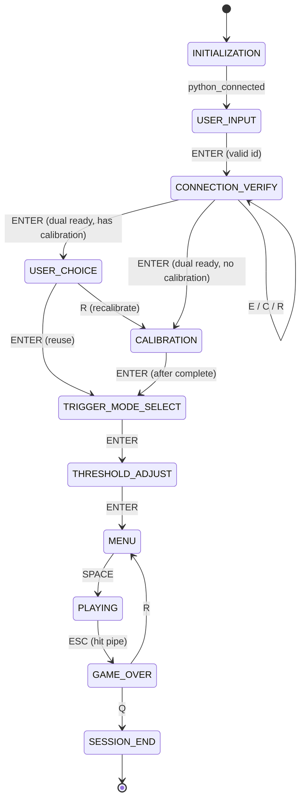

# Game flow and connection logic

This document describes the pygame **HaptiCare shell** workflow in `emg_jump_game.py` (`IntegratedEMGGame`, `EMGGameController`) and how sensor verification relates to `config.CONNECTION_CONFIG`, Delsys, the HapticBall, and the fusion pipeline.

---

## 1. Game flow and scenarios

### 1.1 `GameState` enum (definition order)

Values are the numeric enum members in source order (not necessarily chronological flow):

| # | State | Value | Role |
|---|--------|-------|------|
| 1 | `INITIALIZATION` | 0 | Bootstraps `EMGGameController.initialize()` (Delsys + ball probe). |
| 2 | `USER_INPUT` | 1 | Enter **user id**; **ENTER** creates session and moves to verify. |
| 3 | `CONNECTION_VERIFY` | 11 | Dual-path verification before calibration. |
| 4 | `USER_CHOICE` | 2 | Shown when prior calibration exists: reuse vs recalibrate. |
| 5 | `CALIBRATION` | 3 | `AdvancedCalibrationSystem` runs trials; ball squeeze feedback optional. |
| 6 | `THRESHOLD_ADJUST` | 4 | MVC % entry for fused threshold. |
| 7 | `TRIGGER_MODE_SELECT` | 9 | Choose primary jump: EMG, ball force, or keyboard. |
| 8 | `MENU` | 5 | **SPACE** starts gameplay session. |
| 9 | `PLAYING` | 6 | Flappy-style level; EMG/ball/keyboard per `control_mode`. |
|10 | `GAME_OVER` | 7 | **R** → `MENU` (another run); **Q** → `SESSION_END`. |
|11 | `SESSION_END` | 8 | Saves data and exits. |

### 1.2 Typical chronological flow

1. **INITIALIZATION** → auto-advance when `python_connected` is true → **USER_INPUT**.
2. **USER_INPUT**: type id, **ENTER** → `create_session`, `verify_emg_connection`, ball `ensure_ball_connection` / `verify_ball_connection` → **CONNECTION_VERIFY**.
3. **CONNECTION_VERIFY**: **E** re-verify EMG, **C** connect ball, **R** reset ball verification, **ENTER** when `dual_connections_ready()`:
   - If `calibration_complete` → **USER_CHOICE**;
   - Else → **CALIBRATION** (`start_calibration()`).
4. **USER_CHOICE**: **ENTER** → `_advance_after_calibration` → **TRIGGER_MODE_SELECT**; **R** → **CALIBRATION**.
5. **CALIBRATION**: when complete, **ENTER** → **TRIGGER_MODE_SELECT**.
6. **TRIGGER_MODE_SELECT**: **UP/DOWN**, **ENTER** → **THRESHOLD_ADJUST**.
7. **THRESHOLD_ADJUST**: **ENTER** (after short arm delay) → **MENU**; digits / **UP/DOWN** adjust MVC %.
8. **MENU**: **SPACE** → **PLAYING** (`begin_gameplay_session`, fusion starts).
9. **PLAYING**: **ESC** → **GAME_OVER** (fusion stopped).
10. **GAME_OVER**: **R** → **MENU**; **Q** → **SESSION_END**.

### 1.3 Mermaid state diagram

---

## 2. Verification and connection logic

### 2.1 `CONNECTION_CONFIG` (`config.py`)

| Flag | Meaning |
|------|---------|
| `require_emg_path` | Policy hint (session snapshot); EMG path is expected for a full study. |
| `require_ball_path` | Same for ball. |
| `allow_emg_simulation` | If true, `verify_emg_connection(..., accept_simulation=True)` can mark EMG verified while `DelsysInterface` is in internal simulation. |
| `allow_ball_simulation` | If true, `BallForceMonitor.connect()` may fall back to simulated ball when BLE fails; `ensure_ball_connection` tries hardware then simulation. |

### 2.2 `verify_emg_connection` (`emg_jump_game.py`, `EMGGameController`)

- Syncs flags from `DelsysInterface.is_hardware_connected` (`is_connected and not simulation_mode`).
- If hardware: sets `emg_connection_verified`, clears `emg_using_simulation`.
- Else if `emg_using_simulation` and `accept_simulation` and `allow_emg_simulation`: still verified (yellow **Simulation** path).
- Otherwise not verified.

### 2.3 `verify_ball_connection`

- Requires an active `BallForceMonitor` with `connection_status` in `("connected", "simulated")`.
- Updates `ball_using_simulation` from the monitor; **Hardware** only when status is `connected` and not simulation.

### 2.4 `dual_connections_ready`

- `emg_connection_verified and ball_connection_verified`.

### 2.5 Delsys hardware vs simulation

- **Hardware**: AeroPy path in `delsys_interface.py` `initialize()`; `simulation_mode == False`, `is_connected == True`.
- **Simulation**: AeroPy missing/fails or no sensors; `simulation_mode == True`; internal sine/burst generator in `_simulate_emg_with_timestamps()`.

### 2.6 Ball BLE vs simulation

- `input_HapticBall_interface.HapticBallReader`: BLE when `simulate=False`, internal loop when `simulate=True`.
- `ball_force_monitor.BallForceMonitor.connect()`: tries BLE, optional fallback to simulation per `CONNECTION_CONFIG`.

### 2.7 UI (connection verify and init)

- **Green** text when status string contains **Hardware** and path verified.
- **Yellow** when **Simulation** and verified.
- **Red** when **Not connected** or not verified.
- **CONNECTION_VERIFY** also shows **Live EMG L/R** (from `get_emg_data()`) and **Live force** when `ball_monitor.latest_force()` returns a value (`emg_jump_game.draw_connection_verify`).

---

## 3. Calibration vs gameplay data source

### 3.1 Same Delsys object, different consumers

- **Calibration** (`advanced_calibration.py`, `AdvancedCalibrationSystem`) calls `self.delsys_interface.get_emg_data()` during collection phases (same `DelsysInterface` instance passed from `EMGGameController.initialize()`).
- **Gameplay** uses `EMGFusionPipeline` (`emg_fusion_pipeline.py`), which builds `DataFusion` with that same `delsys_interface`. `DataFusion` wraps it in `DelsysFusionHub` (`input_Delsys_interface.py`), whose hardware poll loop calls `get_emg_data_with_timestamps()` and fans out per-sensor buffers for `get_data()`.

So the **sensor source object is the same** (`DelsysInterface`); **buffers differ**: calibration keeps `sample_buffer` / trial arrays in `AdvancedCalibrationSystem`; gameplay uses fusion `raw_data_buffer` / `processed_emg_buffer` inside `EMGFusionPipeline` (and `DataFusion` internal rings).

### 3.2 Ball path

- **Calibration**: `BallForceMonitor` + `HapticBallReader.get_data()` for squeeze feedback and `_finalize_ball_force_calibration` (`emg_jump_game.py`).
- **Gameplay**: After `begin_gameplay_session`, the monitor’s reader is **released** into `EMGFusionPipeline` / `DataFusion` (`release_reader()`), so the **same reader instance** continues on the fusion bus.

### 3.3 Simulation divergence

- If `simulate_delsys` / `simulate_ball` are true, `DelsysFusionHub` may use `SimulatedDelsysSensor` threads instead of polling `DelsysInterface` hardware (`input_Delsys_interface.py`). That is a **different code path** inside the hub even though the session still holds a `DelsysInterface` for calibration.

### 3.4 Mock TCP lab mode (`VERTICAL_JUMP_MOCK_DEVICES=1`)

- Documented in `MockServerDeviceFolder/README.md`.
- `DelsysInterface` reads EMG from the TCP client bridge while presenting **hardware** flags; `BallForceMonitor` uses `MockTcpForceReader` fed from the same stream. Fusion still receives the same `delsys_interface` and ball reader types as in a normal session, but values originate from JSON lines, not Trigno/BLE.
