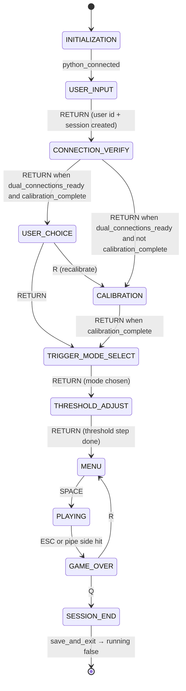

# Game flow, scenarios, connection verification, and calibration vs gameplay data

This document describes the **VerticalJumpPython** session lifecycle: `GameState` transitions, typical hardware/simulation scenarios, how **EMG + HapticBall** verification works (including keys **E / C / R / Enter / S**), and whether **calibration** reads the same streams as **gameplay fusion**.

Primary source file: `emg_jump_game.py`. Policy defaults: `config.py` (`CONNECTION_CONFIG`, `DELSYS_CONFIG`, `BALL_CONFIG`, `FUSION_CONFIG`).

---

## 1. `GameState` diagram (high level)

Enum (excerpt from `emg_jump_game.py`):

| State | Meaning |
|-------|---------|
| `INITIALIZATION` | `EMGGameController.initialize()` until `python_connected` |
| `USER_INPUT` | Enter user id |
| `CONNECTION_VERIFY` | Verify Delsys EMG + ball; live readouts on screen |
| `USER_CHOICE` | Reuse saved calibration vs recalibrate |
| `CALIBRATION` | EMG (+ optional ball squeeze) calibration |
| `THRESHOLD_ADJUST` | MVC % / threshold step |
| `TRIGGER_MODE_SELECT` | EMG vs ball force vs keyboard primary |
| `MENU` | Ready to play |
| `PLAYING` | Jump game + fusion logging |
| `GAME_OVER` | Collision or ESC |
| `SESSION_END` | Save + exit |

### Common keyboard gates

| State | Key | Action |
|-------|-----|--------|
| `USER_INPUT` | `RETURN` | `create_session`, first EMG/ball verify, go to `CONNECTION_VERIFY` |
| `CONNECTION_VERIFY` | `E` | `reconnect_emg_path` (stop fusion, `delsys_interface.initialize()`, re-verify) |
| `CONNECTION_VERIFY` | `C` | `ensure_ball_connection()` |
| `CONNECTION_VERIFY` | `R` | `reset_connection_verify_state()` (stop fusion + ball monitor, clear verify flags) |
| `CONNECTION_VERIFY` | `S` | Optional skip — only if `CONNECTION_CONFIG['allow_skip_connection_verify']` and both sim paths allowed |
| `CONNECTION_VERIFY` | `RETURN` | Continue when `dual_connections_ready()` |
| `MENU` | `SPACE` | Start `PLAYING` |
| `PLAYING` | `ESC` | `GAME_OVER` |
| `GAME_OVER` | `Q` | `SESSION_END` |

---

## 2. Scenarios (hardware vs simulation vs keyboard)

```mermaid
flowchart TD
    subgraph hw_hw["Hardware EMG + hardware ball"]
        A1[Delsys hardware: delsys_connected] --> A2[Ball BLE: BallForceMonitor connected]
        A2 --> A3[CONNECTION_VERIFY shows Live L/R and Live force hardware lines]
        A3 --> A4[Calibration: AdvancedCalibrationSystem uses DelsysInterface.get_emg_data]
        A4 --> A5[Gameplay: EMGFusionPipeline + DataFusion at FUSION_CONFIG master_hz]
    end

    subgraph sim_sim["Simulation EMG + simulation ball"]
        B1[pythonnet missing or no sensors → simulation_mode] --> B2[BLE absent + allow_ball_simulation]
        B2 --> B3[Verified via accept_simulation flags in verify_emg_connection]
        B3 --> B4[Fusion uses simulate_delsys / simulate_ball internally]
    end

    subgraph mixed["Mixed or retry"]
        C1[One path hardware, one sim] --> C2[Screen shows Connected hardware vs Connected simulation per path]
        C2 --> C3[E / C / R until dual_connections_ready]
    end

    subgraph keyboard["Keyboard primary jump"]
        D1[TRIGGER_MODE_SELECT may default to keyboard if EMG not verified]
        D2[PLAYING: SPACE triggers jump when control_mode is keyboard]
    end
```

---

## 3. Verification and connection logic

### 3.1 Policy (`config.py`)

`CONNECTION_CONFIG` includes:

- `require_emg_path`, `require_ball_path`
- `allow_emg_simulation` — from `DELSYS_CONFIG['use_simulation_fallback']`
- `allow_ball_simulation` — from `BALL_CONFIG['simulate_when_absent']`
- `allow_skip_connection_verify` — default `False`; when `True`, **S** on verify screen can coerce simulation paths (requires both `allow_emg_simulation` and `allow_ball_simulation`).

### 3.2 Controller methods (`EMGGameController` in `emg_jump_game.py`)

| Method | Role |
|--------|------|
| `verify_emg_connection(accept_simulation)` | If `delsys_connected` → verified hardware. Else if simulation + `accept_simulation` + `allow_emg_simulation` → verified sim. Else not verified. |
| `verify_ball_connection()` | True when `ball_monitor` exists and `connection_status in ("connected", "simulated")`. Sets `ball_using_simulation`, `ball_hardware_connected`. |
| `dual_connections_ready()` | `emg_connection_verified and ball_connection_verified`. |
| `ensure_ball_connection()` | `connect_ball(False)` then `connect_ball(True)` if sim allowed and hardware failed. |
| `reconnect_emg_path(accept_simulation)` | `stop_emg_processing()`, `delsys_interface.initialize()`, sync flags, `verify_emg_connection`. |
| `reset_connection_verify_state()` | `stop_emg_processing()`, `stop_ball_monitor()`, clear EMG/ball verified flags and ball hardware/sim flags. (No `DelsysInterface.stop()` exists today — AeroPy session is not explicitly torn down here.) |
| `poll_connection_verify_live_samples()` | Samples for verify UI: hardware L/R when `delsys_connected`; sim stream L/R when sim; ball force when monitor shows hardware or sim path. |

### 3.3 Verify screen UI (`draw_connection_verify`)

- Status lines: **Hardware connected** vs **Ready (non-hardware path)** vs **Not connected** (avoids the word “simulation” in headings).
- **Live EMG L/R** only when **Trigno hardware** is active (`delsys_connected`).
- **Live force** matches the May12 **ConnectionCheck** behavior: shown whenever `ball_monitor.latest_force()` returns a value — **(hardware)** for real BLE, **(live stream)** otherwise (e.g. synthetic reader), so you can confirm the pipe even if status flags were slow to update.
- Each frame in `CONNECTION_VERIFY`, `update()` calls **`EMGGameController._sync_connection_verified_from_live_io()`**, which can mark the ball path **verified** when **fresh force samples** arrive even if `connection_status` lagged (ported from `VerticalJumpPython_ConnectionCheck_May12`).

### 3.4 Terminal logging

Startup still prints Delsys init / simulation fallback (e.g. missing `pythonnet`). Additional prints include EMG reconnect, verify reset, and skip attempts when those code paths run.

---

## 4. Calibration vs gameplay: same device data?

**Short answer:** Same **devices and interfaces** when hardware is used, but **not the same code path or sampling rate** as gameplay **fusion**.

### 4.1 EMG (Delsys)

| Phase | How data is read | Typical rate / notes |
|-------|------------------|----------------------|
| **Calibration** | `AdvancedCalibrationSystem` workers call `DelsysInterface.get_emg_data()` (`advanced_calibration.py`). | Workers sleep ~`1/125` s (~125 Hz style polling). |
| **Gameplay** | `DataFusion` / `DelsysFusionHub` polls `get_emg_data_with_timestamps()` / hardware queue; `EMGFusionPipeline._on_fused_frame` builds RMS and buffers. | Fused frames at `FUSION_CONFIG['master_hz']` (default **200 Hz**). |

Same underlying **`DelsysInterface`** object; calibration **does not** run the fusion bus timeline.

### 4.2 Ball (HapticBall)

| Phase | How data is read | Typical rate / notes |
|-------|------------------|----------------------|
| **Verify / calibration monitoring** | `BallForceMonitor` thread, `HapticBallReader.get_data()` at `BALL_CONFIG['poll_hz']` (default **60 Hz**). | Squeeze events optional for calibration feedback. |
| **Gameplay** | Reader is often **released** from the monitor into `EMGFusionPipeline` / `DataFusion`; resampled on fusion bus at **master_hz**. | Same physical reader when handoff succeeds; processing differs (fusion RMS, triggers). |

### 4.3 Simulation

Both phases can use **simulated** EMG and/or ball, but generators may still differ internally (e.g. `SimulatedDelsysSensor` in the fusion hub vs direct `get_emg_data` in sim mode). Treat sim streams as **consistent for testing**, not bit-identical between calibration math and fusion buffers.

---

## 5. Related docs

- `docs/GameData_FIELD_GUIDE.md` — session folder and CSV/JSON fields.
- `docs/INTERACTIVE_PLOTS.md` — interactive matplotlib session viewer.
- `HAPTICARE_UI.md` — bottom navigation shell when using the HaptiCare-style pygame chrome.

---

*Generated for VerticalJumpPython maintainers. Update this file if `GameState` transitions or `CONNECTION_CONFIG` keys change.*
